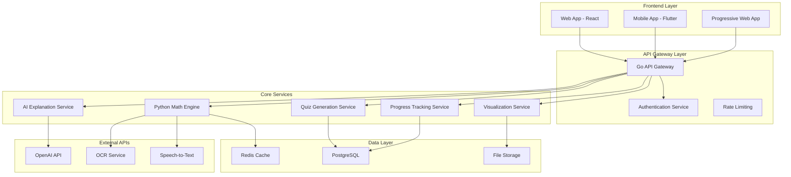

# AI Math Tutor Design Document

## Overview

The AI Math Tutor is a multi-tier educational platform that combines symbolic mathematics computation, AI-powered explanations, and interactive learning features. The system uses a microservices architecture with Python for mathematical computation and AI integration, Go for high-performance API services, and a modern frontend for cross-platform accessibility.

The platform serves as an intelligent mathematics learning companion that not only solves problems but teaches the underlying concepts through step-by-step explanations, visualizations, and adaptive learning paths.

## Architecture

### High-Level Architecture



### Service Communication

- **REST APIs** for standard CRUD operations and user interactions
- **gRPC** for high-performance service-to-service communication between Go and Python services
- **WebSocket** connections for real-time features like live problem solving sessions
- **Message Queue** (Redis Pub/Sub) for asynchronous processing of complex computations

## Components and Interfaces

### 1. Math Engine Service (Python)

**Core Responsibilities:**
- Mathematical problem parsing and solving
- Step-by-step solution generation
- Symbolic mathematics computation
- Integration with SymPy, NumPy, and SciPy

**Key Interfaces:**

```python
class MathEngine:
    def parse_problem(self, problem_text: str, domain: str) -> ParsedProblem
    def solve_step_by_step(self, problem: ParsedProblem) -> StepSolution
    def validate_answer(self, problem: ParsedProblem, answer: str) -> ValidationResult
    def generate_similar_problems(self, problem: ParsedProblem, count: int) -> List[Problem]

class StepSolution:
    steps: List[SolutionStep]
    final_answer: str
    solution_method: str
    confidence_score: float

class SolutionStep:
    step_number: int
    operation: str
    explanation: str
    mathematical_expression: str
    intermediate_result: str
```

**Mathematical Domains Supported:**
- Linear Algebra: Systems of equations, matrix operations, eigenvalues/vectors
- Calculus: Derivatives, integrals, limits, optimization
- Algebra: Polynomial equations, factoring, simplification
- AI/ML Mathematics: Gradients, loss functions, optimization algorithms

### 2. AI Explanation Service (Python)

**Core Responsibilities:**
- Generate natural language explanations for mathematical concepts
- Provide contextual hints and guidance
- Adapt explanation complexity based on user level

**Key Interfaces:**

```python
class AIExplainer:
    def explain_step(self, step: SolutionStep, user_level: str) -> Explanation
    def generate_hint(self, problem: ParsedProblem, current_step: int) -> Hint
    def answer_why_question(self, question: str, context: MathContext) -> Explanation
    def adapt_explanation_level(self, explanation: str, target_level: str) -> str

class Explanation:
    content: str
    complexity_level: str
    related_concepts: List[str]
    examples: List[str]
```

### 3. Visualization Service (Python)

**Core Responsibilities:**
- Generate mathematical plots and graphs
- Create interactive visualizations
- Handle 2D and 3D mathematical representations

**Key Interfaces:**

```python
class VisualizationEngine:
    def plot_function(self, expression: str, domain: Tuple[float, float]) -> PlotData
    def visualize_vector_operations(self, vectors: List[Vector]) -> PlotData
    def create_3d_surface(self, function: str, x_range: Tuple, y_range: Tuple) -> PlotData
    def animate_optimization(self, loss_function: str, optimization_path: List[Point]) -> AnimationData

class PlotData:
    plot_type: str
    data_points: List[Point]
    styling: PlotStyle
    interactive_elements: List[InteractiveElement]
```

### 4. Quiz Generation Service (Go)

**Core Responsibilities:**
- Generate adaptive quizzes based on user progress
- Manage quiz sessions and scoring
- Provide immediate feedback

**Key Interfaces:**

```go
type QuizService interface {
    GenerateQuiz(userID string, topic string, difficulty int) (*Quiz, error)
    SubmitAnswer(quizID string, questionID string, answer string) (*AnswerResult, error)
    GetQuizResults(quizID string) (*QuizResults, error)
    AdaptDifficulty(userID string, performance *Performance) error
}

type Quiz struct {
    ID          string
    Questions   []Question
    TimeLimit   time.Duration
    Topic       string
    Difficulty  int
}

type Question struct {
    ID          string
    Text        string
    Type        QuestionType
    Options     []string
    Hints       []string
}
```

### 5. Progress Tracking Service (Go)

**Core Responsibilities:**
- Track user learning progress and performance
- Generate personalized learning recommendations
- Manage user profiles and preferences

**Key Interfaces:**

```go
type ProgressService interface {
    TrackProblemSolution(userID string, problem *Problem, performance *Performance) error
    GetLearningPath(userID string) (*LearningPath, error)
    UpdateUserProfile(userID string, profile *UserProfile) error
    GetRecommendations(userID string) ([]Recommendation, error)
}

type UserProfile struct {
    ID              string
    SkillLevels     map[string]int
    LearningGoals   []string
    Preferences     UserPreferences
    ProgressMetrics ProgressMetrics
}
```

## Data Models

### Core Data Structures

```sql
-- Users and Authentication
CREATE TABLE users (
    id UUID PRIMARY KEY,
    email VARCHAR(255) UNIQUE NOT NULL,
    username VARCHAR(100) UNIQUE NOT NULL,
    password_hash VARCHAR(255) NOT NULL,
    created_at TIMESTAMP DEFAULT NOW(),
    updated_at TIMESTAMP DEFAULT NOW()
);

-- User Profiles and Progress
CREATE TABLE user_profiles (
    user_id UUID PRIMARY KEY REFERENCES users(id),
    skill_levels JSONB NOT NULL DEFAULT '{}',
    learning_goals TEXT[],
    preferences JSONB NOT NULL DEFAULT '{}',
    total_problems_solved INTEGER DEFAULT 0,
    current_streak INTEGER DEFAULT 0,
    created_at TIMESTAMP DEFAULT NOW(),
    updated_at TIMESTAMP DEFAULT NOW()
);

-- Mathematical Problems
CREATE TABLE problems (
    id UUID PRIMARY KEY,
    problem_text TEXT NOT NULL,
    domain VARCHAR(50) NOT NULL,
    difficulty_level INTEGER NOT NULL,
    solution_steps JSONB NOT NULL,
    tags TEXT[],
    created_at TIMESTAMP DEFAULT NOW()
);

-- User Problem Attempts
CREATE TABLE problem_attempts (
    id UUID PRIMARY KEY,
    user_id UUID REFERENCES users(id),
    problem_id UUID REFERENCES problems(id),
    user_answer TEXT,
    is_correct BOOLEAN NOT NULL,
    time_taken INTEGER, -- seconds
    hints_used INTEGER DEFAULT 0,
    attempt_timestamp TIMESTAMP DEFAULT NOW()
);

-- Quizzes and Sessions
CREATE TABLE quiz_sessions (
    id UUID PRIMARY KEY,
    user_id UUID REFERENCES users(id),
    topic VARCHAR(100) NOT NULL,
    difficulty_level INTEGER NOT NULL,
    total_questions INTEGER NOT NULL,
    correct_answers INTEGER DEFAULT 0,
    started_at TIMESTAMP DEFAULT NOW(),
    completed_at TIMESTAMP,
    status VARCHAR(20) DEFAULT 'active'
);

-- Learning Progress Tracking
CREATE TABLE learning_progress (
    id UUID PRIMARY KEY,
    user_id UUID REFERENCES users(id),
    topic VARCHAR(100) NOT NULL,
    mastery_level DECIMAL(3,2) NOT NULL, -- 0.00 to 1.00
    last_practiced TIMESTAMP DEFAULT NOW(),
    practice_count INTEGER DEFAULT 0
);
```

### Caching Strategy

**Redis Cache Structure:**
- User sessions: `session:{user_id}` (TTL: 24 hours)
- Problem solutions: `solution:{problem_hash}` (TTL: 1 hour)
- Visualization data: `viz:{viz_hash}` (TTL: 30 minutes)
- AI explanations: `explanation:{context_hash}` (TTL: 2 hours)

## Error Handling

### Error Categories and Responses

1. **Mathematical Parsing Errors**
   - Invalid mathematical notation
   - Unsupported problem types
   - Ambiguous expressions

2. **Computation Errors**
   - Numerical instability
   - Timeout on complex calculations
   - Memory limitations

3. **AI Service Errors**
   - OpenAI API failures
   - Rate limiting
   - Invalid responses

4. **User Input Errors**
   - Malformed requests
   - Authentication failures
   - Validation errors

### Error Response Format

```json
{
  "error": {
    "code": "MATH_PARSE_ERROR",
    "message": "Unable to parse mathematical expression",
    "details": {
      "expression": "2x + 3y =",
      "position": 8,
      "suggestion": "Expression appears incomplete. Please provide the right side of the equation."
    },
    "timestamp": "2024-01-15T10:30:00Z"
  }
}
```

### Fallback Strategies

- **AI Service Failures**: Fall back to rule-based explanations
- **Visualization Errors**: Provide text-based mathematical representations
- **Complex Computation Timeouts**: Offer simplified problem variants
- **External API Failures**: Queue requests for retry with exponential backoff

## Testing Strategy

### Unit Testing

**Python Services:**
- Mathematical computation accuracy tests using known problem sets
- AI explanation quality tests with human-validated responses
- Visualization rendering tests with expected output comparisons

**Go Services:**
- API endpoint testing with comprehensive request/response validation
- Concurrent user simulation for performance testing
- Database integration tests with test fixtures

### Integration Testing

- End-to-end problem solving workflows
- Cross-service communication testing
- External API integration testing with mocked responses
- User authentication and authorization flows

### Performance Testing

- Load testing with simulated concurrent users (target: 1000+ concurrent)
- Mathematical computation benchmarking
- Database query optimization validation
- Caching effectiveness measurement

### Educational Effectiveness Testing

- A/B testing for different explanation approaches
- User comprehension measurement through follow-up quizzes
- Learning path effectiveness analysis
- Visualization impact on understanding assessment

## Security Considerations

### Authentication and Authorization

- JWT-based authentication with refresh tokens
- Role-based access control (student, educator, admin)
- API rate limiting per user and endpoint
- Input sanitization for all mathematical expressions

### Data Protection

- Encryption at rest for user data and problem solutions
- HTTPS/TLS for all client-server communication
- Personal data anonymization for analytics
- GDPR compliance for user data management

### AI Safety

- Content filtering for AI-generated explanations
- Mathematical accuracy validation for all AI responses
- Prompt injection prevention for user inputs
- Bias detection in educational content recommendations

## Deployment and Scalability

### Container Architecture

```dockerfile
# Python Math Engine
FROM python:3.11-slim
RUN pip install sympy numpy matplotlib scipy torch
COPY math_engine/ /app/
EXPOSE 8001

# Go API Gateway
FROM golang:1.21-alpine
COPY api_gateway/ /app/
RUN go build -o main .
EXPOSE 8000

# Frontend
FROM node:18-alpine
COPY frontend/ /app/
RUN npm install && npm run build
EXPOSE 3000
```

### Scaling Strategy

- **Horizontal scaling** for stateless services (API Gateway, Math Engine)
- **Database read replicas** for improved query performance
- **CDN integration** for static assets and visualizations
- **Auto-scaling** based on CPU and memory metrics
- **Load balancing** with health checks and circuit breakers

### Monitoring and Observability

- Application metrics: Response times, error rates, user engagement
- Infrastructure metrics: CPU, memory, disk usage, network I/O
- Business metrics: Problems solved, user retention, learning outcomes
- Distributed tracing for cross-service request tracking
- Centralized logging with structured log formats